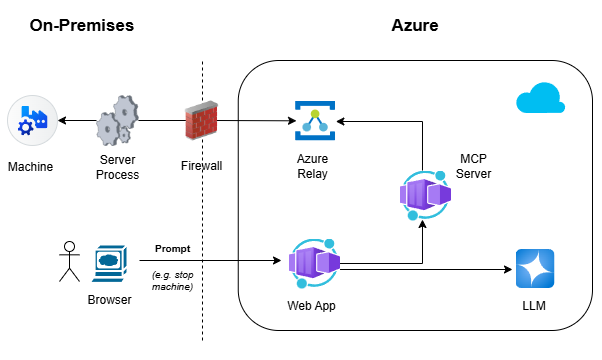
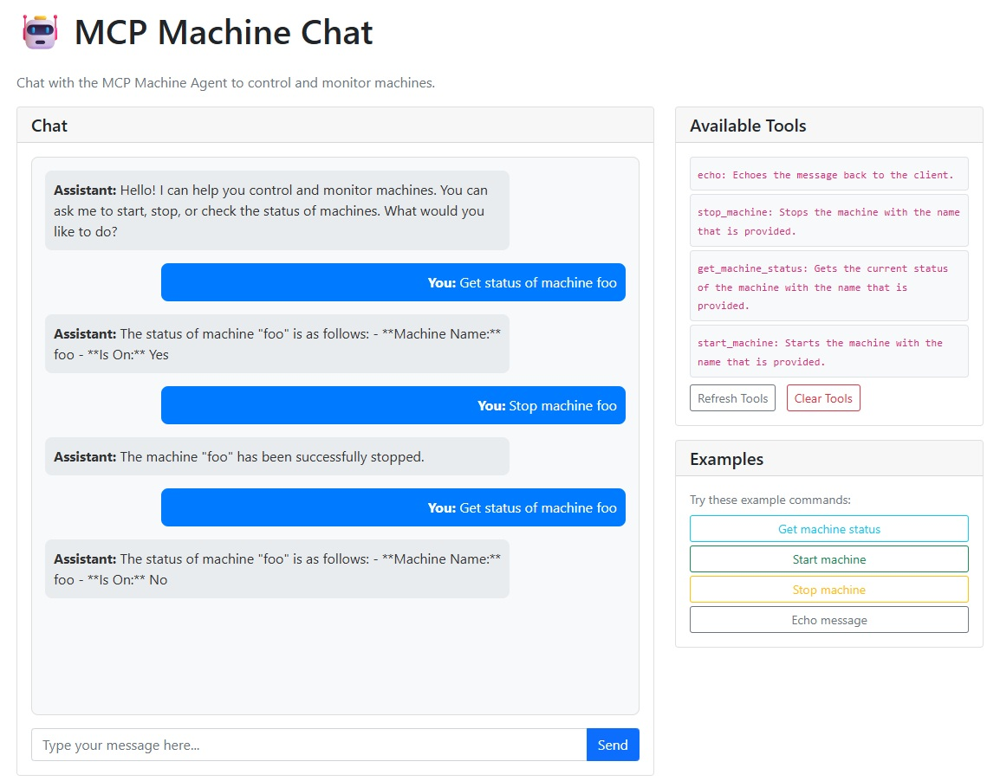

# On-Premises MCP Server Solution

A sample solution demonstrating secure remote machine management using the Model Context Protocol (MCP) with Azure services. This solution enables natural language control of (simulated) on-premises machines without requiring inbound firewall ports, using Azure Relay for secure outbound-only connections.

## 🏗️ Architecture Overview

This solution implements a hybrid cloud architecture with the following components:
- **On-premises server**: (simulated) machine control process that runs behind a corporate firewall with outbound-only connectivity
- **Cloud components** AI-powered natural language interfaces and protocol bridging
- **Azure Relay** secure bi-directional communication without inbound ports
- **MCP (Model Context Protocol)** tool discovery and execution



A user sends a prompt (e.g. `stop machine 'foo'`) from the browser to the web client app that is hosted in Azure Container Apps:



The web app maintains a Semantic Kernel agent that has a connection to an Azure OpenAI LLM and also a connection to the MCP server that is hosted in another Container App. The agent processes the prompt (using the LLM) and determines if an MCP tool call is required and which tool to use (e.g. the tool to stop a machine).

If a tool call is required, the agent sends the request to the MCP server with the corresponding parameters. The MCP Server maintains a connection to an Azure Relay hybrid connection endpoint, which it can use to send requests to the on-premises server. For this to work, the on-premises server process also needs to maintain a connection to the same Azure Relay hybrid connection endpoint. The Relay will then broker the communication between the two endpoints, and the on-prem server process will get the request from the MCP server in Azure, execute the command (in this case stop the machine) and return the result.

## 📦 Solution Components

### 1. [On-Premises Server](app/server/README.md)
**Firewall-Friendly Machine Controller**

A lightweight server component designed to run on-premises behind corporate firewalls. It simulates controlling machines while maintaining secure outbound-only connections to the cloud MCP server via Azure Relay. This component handles machine state persistence (local JSON file) and processes control commands (start/stop/status) for machines. The design allows for on-demand connection establishment, making it suitable for production environments where network resources are carefully managed.

### 2. [MCP Server](app/mcpserver/README.md)
**Cloud-Hosted Protocol Bridge**

The core MCP (Model Context Protocol) server implementation that acts as a bridge between AI clients and on-premises machines. Built with ASP.NET Core, it exposes standardized MCP tools for machine management operations while securely communicating with on-premises servers through an Azure Relay Hybrid Connection. The server provides RESTful endpoints for tool discovery, handles protocol negotiation, and maintains connection state. It's containerized for easy deployment to Azure Container Apps and includes logging and health monitoring.

### 3. [Web Client](app/webclient/README.md)
**Browser-Based Chat Interface**

An ASP.NET Core web application that provides a chat interface for interacting with machines through natural language. The web client offers an intuitive Bootstrap-based UI with real-time message exchange, tool discovery panel, and example command buttons. It's containerized and ready for deployment to Azure Container Apps, making it perfect for team collaboration and remote access scenarios.

### 4. [Console Client](app/client/README.md) 
**AI-Powered Command Line Interface**

A simple console application that connects to the MCP server and provides natural language interaction with machine management tools. Built with Microsoft Semantic Kernel and Azure OpenAI, this client acts as an AI agent that can understand conversational commands like "start machine foo" or "check the status of machine 'bar'" and translate them into appropriate tool executions. Features automatic MCP tool discovery, context-aware conversations, and seamless integration with Azure OpenAI services.

## 🚀 Quick Start

### Prerequisites
- .NET 9.0 SDK
- Azure subscription with:
  - Azure OpenAI service
  - Azure Service Bus (for Relay)
- Docker (optional, for containerized deployment)

### 1. Infrastructure Setup
```bash
# Deploy Azure resources using Bicep templates
az deployment group create --resource-group <rg-name> --template-file infra/main.bicep
```

### 2. Configuration
Copy the example configuration files and update with your Azure service endpoints:
```bash
# Configure each component
cp app/client/appsettings.example.json app/client/appsettings.json
cp app/mcpserver/appsettings.example.json app/mcpserver/appsettings.json
cp app/server/appsettings.example.json app/server/appsettings.json
cp app/webclient/appsettings.example.json app/webclient/appsettings.json
```

### 3. Local Development
```bash
# Start the on-premises server (simulates machines behind firewall)
cd app/server && dotnet run

# Start the MCP server (cloud component)
cd app/mcpserver && dotnet run --urls=http://localhost:5000

# Try the console client
cd app/client && dotnet run

# Or start the web client
cd app/webclient && dotnet run --urls=http://localhost:5001
```

## 🌐 Cloud Deployment

All components are ready for Azure deployment:

- **MCP Server**: Deploy to Azure Container Apps with ingress limited to the Container Apps Environment
- **Web Client**: Deploy to Azure Container Apps with external ingress  
- **On-Premises Server**: Run locally or in private networks with outbound connectivity

See individual component README files for detailed deployment instructions.

## 🔧 Infrastructure as Code

The `infra/` directory contains Bicep templates for deploying the required Azure resources:
- Azure Container Registry for hosting container images
- Azure Container Apps Environment for running cloud components
- Azure Service Bus Relay for secure hybrid connectivity
- Log Analytics workspace for monitoring

## 🔒 Security Features

- **Zero Inbound Ports**: On-premises components use outbound-only connections
- **Azure Relay**: Secure tunneling without VPN complexity
- **Easy Auth**: If you want to protect the web applications, consider configuring [Easy Auth](https://learn.microsoft.com/en-us/azure/container-apps/authentication) for user authentication.
- **MCP Server API**: The MCP Server is configured with Ingress that allows access only from within the Container Apps environment.

*Note*: In a production environment, the MCP Server should be secured using OAuth 2.1, as described in the [specification](https://modelcontextprotocol.io/specification/draft/basic/authorization).

## 🛠️ Technology Stack

- **.NET 9.0**: Modern, cross-platform runtime
- **Model Context Protocol (MCP)**: Standardized AI tool integration
- **Microsoft Semantic Kernel**: AI orchestration framework
- **Azure OpenAI**: Large language model services
- **Azure Service Bus Relay**: Hybrid cloud connectivity
- **ASP.NET Core**: Web framework for servers and clients
- **Docker**: Containerization for cloud deployment
- **Bicep**: Infrastructure as Code templates

## 🤝 Contributing

This is a demonstration solution. For production use, consider implementing additional security measures, error handling, logging, and monitoring based on your organizational requirements.